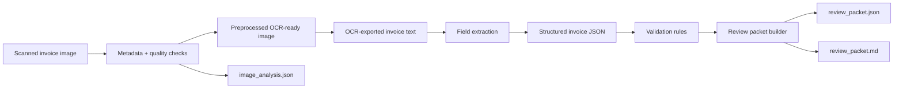

# document-intelligence-copilot

A local-first invoice workflow with two explicit lanes: text extraction for OCR-exported invoice text, and scan analysis for invoice images that need OCR-readiness checks and preprocessing before text extraction.


## Results

| Area | Details |
|---|---|
| Structured extraction | Sample invoice `INV-2048` extracts vendor, invoice id, dates, `3` line items, payment terms, and total amount. |
| Reconciliation check | Line-item subtotal reconciles to `18450.75 USD`, matching the invoice amount. |
| Review routing | Validation status is `needs_review` when the invoice exceeds the manual-review threshold. |
| Scan readiness | Image lane reports `900 x 1200` sample scan metadata, OCR-readiness diagnostics, and preprocessing artifacts. |
| Human feedback | `/corrections` appends operator corrections to JSONL for future tuning. |

## Overview

- Document AI workflows need extraction, validation, review packets, and correction loops, not just OCR output.
- The repo shows both text extraction and scan-quality analysis in one auditable FastAPI workflow.
- The implementation combines document parsing, validation, review packets, correction feedback, and API endpoints in one workflow.

## Problem

Document AI demos often stop at "the model guessed some fields." Real document workflows need more than extraction: teams need traceable parsing, confidence cues, business-rule validation, and a clean handoff to human review when the document is ambiguous. They also need a way to decide whether a scanned invoice image is even ready for OCR before downstream parsing begins. This repo focuses on that trust layer instead of pretending OCR alone solves the workflow.

## Architecture

The implementation is deliberately lightweight and inspectable:

- sample OCR-exported invoice text and sample grayscale scan images live in the repo
- a scan-analysis lane extracts image metadata, scores OCR readiness, and writes preprocessed grayscale and binarized artifacts
- a text extraction layer parses vendor, invoice identifiers, dates, amounts, currency, payment terms, and invoice line items from OCR-exported text
- a validation layer applies business checks such as missing required fields, due-date ordering, line-item arithmetic mismatches, and suspicious totals
- a review layer combines extracted fields, confidence signals, and validation issues into a human-review packet
- operator corrections can be captured as append-only feedback records for future tuning
- a FastAPI surface exposes both the image-analysis lane and the text extraction lane



## Supported Inputs

This repo supports two input shapes:

- OCR-exported invoice text for field extraction and review-packet generation
- scanned invoice images for metadata extraction, OCR-readiness scoring, and preprocessing

The image lane does not run OCR and does not extract invoice fields directly from pixels. Its job is to decide whether a scan is usable and to emit cleaned image artifacts for a downstream OCR step.

Supported text-extraction API shape:

```json
{
  "document_name": "sample-invoice.txt",
  "text": "Vendor: Northwind Industrial Supply\nInvoice Number: INV-2048\n..."
}
```

Supported image-analysis API shape:

```json
{
  "document_name": "invoice-scan.png",
  "image_base64": "<base64-encoded image bytes>",
  "persist_artifacts": true
}
```

The `/extract` endpoint returns a review packet with extracted fields, confidence metadata, validation issues, and a recommended action.

The `/analyze-image` endpoint returns image metadata, quality diagnostics, an OCR-readiness score, and any saved preprocessing artifact paths.

The `/corrections` endpoint records human feedback as an append-only JSONL log so future extraction tuning can reuse real corrections.

## Pipeline Stages

The flow is:

1. A scanned invoice image can be analyzed for metadata, image quality, and OCR readiness.
2. The image lane writes grayscale and binarized artifacts for downstream OCR when the scan is usable enough.
3. OCR-exported invoice text enters the extraction workflow.
4. The extractor pulls out the vendor, invoice metadata, amount, currency, payment terms, optional purchase order, and individual line items.
5. The validator checks for missing or suspicious values, verifies line-item arithmetic, and reconciles the line-item subtotal against the invoice total.
6. The review layer packages the result for human approval.
7. Operator corrections can be recorded against a document and field for later feedback loops.

## Tradeoffs

This implementation makes three deliberate tradeoffs:

1. The image lane stops at scan analysis and preprocessing. It does not bundle OCR, PDF parsing, or cloud vision APIs.
2. Text extraction uses transparent rule-based parsing instead of a large model because the goal is a dependable review workflow, not a black-box demo.
3. The review surface is JSON plus Markdown rather than a front-end app so the workflow is easy to verify locally and in CI.

## Repo Layout

```text
document-intelligence-copilot/
├── app/
│   ├── cli.py
│   ├── extraction.py
│   ├── main.py
│   ├── models.py
│   ├── review.py
│   ├── validation.py
│   └── vision.py
├── generated/
├── samples/
└── tests/
```

## Run Steps

### Install Dependencies

```bash
git clone https://github.com/srn91/document-intelligence-copilot.git
cd document-intelligence-copilot
python3 -m pip install -r requirements.txt
```

### Generate a Review Packet

```bash
make review
```

That writes:

- `generated/sample_invoice_review.json`
- `generated/sample_invoice_review.md`

### Analyze the Sample Invoice Scan

```bash
make analyze-image
```

That writes:

- `generated/sample_invoice_scan_image_analysis.json`
- `generated/sample_invoice_scan_ocr_grayscale.png`
- `generated/sample_invoice_scan_ocr_binarized.png`

### Start the API

```bash
make serve
```

Useful endpoints:

- `http://127.0.0.1:8000/health`
- `http://127.0.0.1:8000/sample-documents`
- `http://127.0.0.1:8000/extract/sample-invoice`
- `http://127.0.0.1:8000/analyze/sample-invoice-image`
- `http://127.0.0.1:8000/analyze-image`
- `http://127.0.0.1:8000/corrections`

### Run the Full Quality Gate

```bash
make verify
```

## Hosted Deployment

- Live demo: [document-intelligence-copilot.onrender.com](https://document-intelligence-copilot.onrender.com)
- Sample API: [`/extract/sample-invoice`](https://document-intelligence-copilot.onrender.com/extract/sample-invoice)
- Browser smoke result: the hosted sample extraction returned a full review packet in-browser, including structured fields, confidence metadata, validation issues, and the recommended action.
- Render config: branch `main`, auto-deploy on commit, runtime `python`, build command `pip install -r requirements.txt`, start command `uvicorn app.main:app --host 0.0.0.0 --port $PORT`, health check path `/health`

## Validation

The repo currently verifies:

- required invoice fields are extracted into structured JSON
- extraction confidence is surfaced per field instead of hidden
- business validation flags missing or suspicious values before approval
- line-item arithmetic and document-level total reconciliation are checked explicitly
- sample invoice scans produce image metadata, OCR-readiness diagnostics, and preprocessing artifacts
- lower-quality scans are flagged for review before OCR
- human corrections are written to an append-only JSONL log
- CLI and API use the same extraction and image-analysis logic

Current sample review snapshot:

- vendor: `Northwind Industrial Supply`
- invoice id: `INV-2048`
- invoice amount: `18450.75 USD`
- line items extracted: `3`
- line-item subtotal: `18450.75 USD`
- payment terms: `Net 30`
- validation status: `needs_review` because the invoice exceeds the manual-review amount threshold

Sample image-analysis snapshot:

- image format: `PGM`
- sample scan size: `900 x 1200`
- preprocessing artifacts: grayscale plus binarized OCR-ready images
- readiness result: the sample scan is marked `needs_review` because the edge-density check still flags it as a soft scan
- degraded sample: the low-quality scan is flagged for resolution or contrast review before OCR

Local quality gates:

- `make lint`
- `make test`
- `make review`
- `make analyze-image`
- `make verify`

## Capabilities

The repo demonstrates:

- deterministic parsing of OCR-style invoice text
- structured invoice extraction with confidence metadata
- image metadata extraction for scanned invoice files
- OCR-readiness scoring based on resolution, brightness, contrast, sharpness, and foreground coverage
- grayscale and binarized preprocessing outputs for downstream OCR
- validation rules for missing fields, due-date ordering, line-item reconciliation, and high-value manual review
- human-review JSON and Markdown outputs
- correction capture for future tuning
- FastAPI endpoints for sample extraction, ad hoc text submission, and ad hoc image analysis
