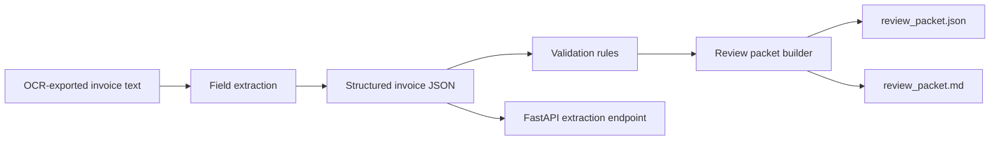

# document-intelligence-copilot

A local-first document intelligence workflow that ingests OCR-exported invoice text, extracts structured business fields, validates them, and produces reviewer-ready output for human signoff.

## Problem

Document AI demos often stop at "the model guessed some fields." Real document workflows need more than extraction: teams need traceable parsing, confidence cues, business-rule validation, and a clean handoff to human review when the document is ambiguous. This repo focuses on that trust layer instead of pretending OCR alone solves the workflow.

## Architecture

The V1 implementation is deliberately lightweight and inspectable:

- sample OCR-exported invoice text files live in the repo
- an extraction layer parses vendor, invoice identifiers, dates, amounts, currency, and payment terms
- a validation layer applies business checks such as missing required fields, due-date ordering, and suspicious totals
- a review layer combines extracted fields, confidence signals, and validation issues into a reviewer-facing packet
- a FastAPI surface exposes the same extraction path that the CLI uses



## Tradeoffs

This V1 makes three deliberate tradeoffs:

1. The repo starts from OCR-exported text rather than raw PDFs or images so the extraction and validation logic stays runnable without external OCR binaries or cloud APIs.
2. Extraction uses transparent rule-based parsing instead of a large model because the goal is a dependable review workflow, not a black-box demo.
3. The review surface is JSON plus Markdown rather than a front-end app so the workflow is easy to verify locally and in CI.

## Repo Layout

```text
document-intelligence-copilot/
├── app/
│   ├── cli.py
│   ├── extraction.py
│   ├── main.py
│   ├── models.py
│   ├── review.py
│   └── validation.py
├── generated/
├── samples/
└── tests/
```

## Run Steps

### Install Dependencies

```bash
git clone git@github.com:srn91/document-intelligence-copilot.git
cd document-intelligence-copilot
python3 -m pip install -r requirements.txt
```

### Generate a Review Packet

```bash
make review
```

That writes:

- `generated/sample_invoice_review.json`
- `generated/sample_invoice_review.md`

### Start the API

```bash
make serve
```

Useful endpoints:

- `http://127.0.0.1:8000/health`
- `http://127.0.0.1:8000/sample-documents`
- `http://127.0.0.1:8000/extract/sample-invoice`

### Run the Full Quality Gate

```bash
make verify
```

## Validation

The V1 repo currently verifies:

- required invoice fields are extracted into structured JSON
- extraction confidence is surfaced per field instead of hidden
- business validation flags missing or suspicious values before approval
- CLI and API use the same extraction and review logic

Current sample review snapshot:

- vendor: `Northwind Industrial Supply`
- invoice id: `INV-2048`
- invoice amount: `18450.75 USD`
- payment terms: `Net 30`
- validation status: `needs_review` because the invoice exceeds the manual-review amount threshold

Local quality gates:

- `make lint`
- `make test`
- `make review`
- `make verify`

## Current Capabilities

The V1 repo demonstrates:

- deterministic parsing of OCR-style invoice text
- structured invoice extraction with confidence metadata
- validation rules for missing fields, due-date ordering, and high-value manual review
- reviewer-ready JSON and Markdown outputs
- FastAPI endpoints for sample extraction and ad hoc text submission

## Next Steps

Realistic follow-up work for the next milestone:

1. add PDF and image ingestion with a pluggable OCR provider interface
2. support line-item extraction and total reconciliation
3. add reviewer correction capture for future feedback loops
4. add vendor-specific extraction templates and anomaly thresholds
5. expose a small browser review UI on top of the review packet
